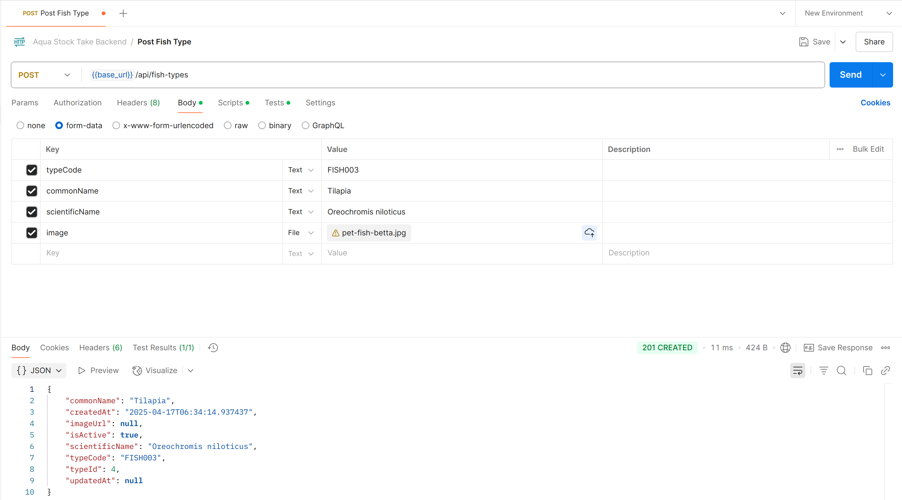

# 🌊 Aqua Backend
A lightweight Flask + PostgreSQL backend to manage fish types in an aquaculture stock tracking system.

## Dependencies
Install the required system packages and Python libraries
```
sudo apt update
sudo apt install postgresql postgresql-contrib

pip install Flask Flask-Cors Flask-SQLAlchemy psycopg2-binary
```

## 🛠️ Setup Instructions
1. Setup PostgreSQL
    ```
    # Switch to the postgres user
    sudo -i -u postgres
    
    # Enter PostgreSQL shell
    psql
    
    # Inside psql:
    -- Create user
    CREATE USER username WITH PASSWORD 'password';

    -- Create database
    CREATE DATABASE aquastock OWNER username;

    -- Connect to the database
    \c aquastock

    -- Grant schema privileges
    GRANT USAGE, CREATE ON SCHEMA public TO username;

    -- Grant access to all tables/sequences (just in case)
    GRANT ALL PRIVILEGES ON ALL TABLES IN SCHEMA public TO username;
    GRANT ALL PRIVILEGES ON ALL SEQUENCES IN SCHEMA public TO username;

    -- Set default privileges so future tables/sequences are included
    ALTER DEFAULT PRIVILEGES IN SCHEMA public GRANT ALL ON TABLES TO username;
    ALTER DEFAULT PRIVILEGES IN SCHEMA public GRANT ALL ON SEQUENCES TO username;
    \q
    
    # Exit back to your regular user
    exit
    ```
    
2. Run the Backend Server
    ```
    python app.py
    ```
    The server will start at:📍 http://localhost:5000/

## Flask-Migrate
🧠 In simpler terms:
It helps you track changes to your database models and apply those changes to the actual PostgreSQL/MySQL/SQLite database — safely and incrementally.

- ✅ First-Time Setup
    Initializes the migrations folder and sets up the database schema:
    ```
    python -m flask db migrate -m "New db"
    ./init_db.sh
    ```
- 🔄 When You Add or Modify a Model
    Generate a new migration and apply it:
    ```
    python -m flask db migrate -m "Add Tank model"
    python -m flask db upgrade
    ```
- 🧪 Verify Current Database Schema
    Prints all tables and their columns to confirm everything is applied correctly:
    ```
    ./print_db_schema.sh
    ```

## Testing with Postman
Use Postman to test each endpoint with form-data (especially for image uploads). Collection [Aqua Stock Take Backend.postman_collection.json](./config/Aqua%20Stock%20Take%20Backend.postman_collection.json) had been provided.



## Useful Commands
1. Reset the db from psql
    ```
    -- Drop the database if it exists
    DROP DATABASE IF EXISTS aquastock;

    REVOKE ALL PRIVILEGES ON SCHEMA public FROM username;
    REVOKE ALL PRIVILEGES ON ALL TABLES IN SCHEMA public FROM username;
    REVOKE ALL PRIVILEGES ON ALL SEQUENCES IN SCHEMA public FROM username;

    -- Drop default privileges granted by postgres TO username
    ALTER DEFAULT PRIVILEGES FOR ROLE postgres IN SCHEMA public REVOKE ALL ON TABLES FROM username;
    ALTER DEFAULT PRIVILEGES FOR ROLE postgres IN SCHEMA public REVOKE ALL ON SEQUENCES FROM username;

    DROP USER IF EXISTS username;
    ```

2. Delete entire database
    ```
    # Become postgres superuser
    sudo -i -u postgres

    # Terminate any open connections (replace aquastock if different)
    psql -c "
    SELECT pg_terminate_backend(pid)
    FROM   pg_stat_activity
    WHERE  datname = 'aquastock';
    "

    # Drop role & DB, then recreate both
    psql <<'SQL'
    DROP DATABASE IF EXISTS aquastock;
    DROP USER IF EXISTS username;              -- your app role
    CREATE USER username WITH PASSWORD 'password';
    CREATE DATABASE aquastock OWNER username;
    GRANT ALL PRIVILEGES ON DATABASE aquastock TO username;
    SQL
    exit          # back to your normal user
    ```